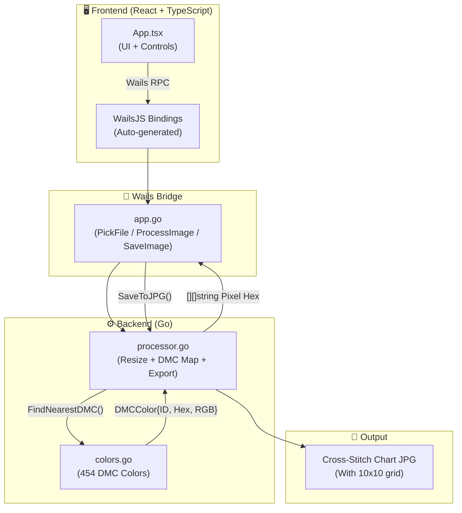

# PontoCrz

<div align="center">


**Convert photos into professional Cross-Stitch charts using the official DMC palette**

[](https://go.dev)
[](https://wails.io)
[](https://react.dev)
[](https://typescriptlang.org)
[](https://kernel.org)
[](https://microsoft.com)
[](https://snapcraft.io/ponto-crz)

</div>

---

## 📖 About

**PontoCrz** is a desktop application that converts any image (JPG, PNG) into a professional **Cross-Stitch chart**, featuring:

- **Official DMC palette** with 454 colors matched via RGB Euclidean distance
- **Nearest Neighbor** algorithm for crisp, pixel-perfect resizing
- **Technical grid** with 10×10 reference markers for counting stitches
- **A4 / A3 export** at 300 DPI — ready for printing

---

## 🏗️ Architecture



---

## ⚙️ Technology Stack

| Technology | Version | Purpose |
|---|---|---|
| **Go** | 1.21+ | Backend, image processing, business logic |
| **Wails** | v2.11 | Native bridge between Go and the React frontend |
| **React** | 18 | User interface (SPA) |
| **TypeScript** | 5 | Type-safe frontend code |
| **Vite** | 3 | Frontend build tool |
| **golang.org/x/image** | latest | Nearest Neighbor resize |
| **image/jpeg** (stdlib) | — | JPG export with technical grid |
| **sync.WaitGroup** (stdlib) | — | Parallel processing with Goroutines |

---

## 🧩 How It Works — Core Logic

### 1. Image → DMC Pixels (`processor.go`)

```go
// Crisp resize using Nearest Neighbor (no blur)
resized := image.NewRGBA(image.Rect(0, 0, targetWidth, targetHeight))
draw.NearestNeighbor.Scale(resized, resized.Bounds(), img, bounds, draw.Over, nil)

// Map each pixel to the nearest DMC color in the palette
for y := startRow; y < endRow; y++ {
    for x := 0; x < targetWidth; x++ {
        c := resized.At(x, y)
        r32, g32, b32, _ := c.RGBA()
        r, g, b := uint8(r32>>8), uint8(g32>>8), uint8(b32>>8)

        nearest := FindNearestDMC(r, g, b) // 454-color palette
        pixels[y][x] = nearest.Hex         // e.g. "#3B1F14"
    }
}
```

### 2. Export with Technical Grid (`processor.go`)

```go
func SaveToJPG(outputPath string, data *ProcessedImage, cellSize int) error {
    const gridSize = 1  // Regular grid line: 1px
    const majorSize = 3 // Reference line every 10 stitches: 3px

    // Thicker lines every 10 squares — makes counting stitches easy
    for x := 0; x <= data.Width; x++ {
        thickness := gridSize
        if x > 0 && x%10 == 0 { thickness = majorSize }
        ...
    }
}
```

---

## 🚀 Installation

### Prerequisites

- **Go** 1.21+: [go.dev/dl](https://go.dev/dl)
- **Node.js** 18+ & **npm**: [nodejs.org](https://nodejs.org)
- **Wails CLI** v2: `go install github.com/wailsapp/wails/v2/cmd/wails@latest`

---

### 🐧 Linux — Run directly

```bash
git clone https://github.com/your-user/pontoCrz.git
cd pontoCrz

# The binary is already in build/bin/
chmod +x build/bin/pontoCrz
./build/bin/pontoCrz
```

### 🐧 Linux — Flatpak

```bash
# Install the Flatpak package
flatpak install build/bin/pontoCrz.flatpak

# Run
flatpak run br.com.pontoCrz
```

### 🐧 Linux — Snap

```bash
# Instalar a versão via Snap
sudo snap install ponto-crz
```

### 🪟 Windows — Run directly

```
1. Download and extract the repository
2. Run: build\bin\pontoCrz.exe
```

### 🪟 Windows — Installer

```
1. Run: build\bin\pontoCrz-amd64-installer.exe
2. Follow the NSIS installer steps
3. A desktop shortcut is created automatically
```

---

## 🔨 Build from Source

### Linux

```bash
wails build
# Output: build/bin/pontoCrz
```

### Windows (cross-compile from Linux)

```bash
sudo apt install gcc-mingw-w64-x86-64 nsis
wails build --platform windows/amd64 -nsis
# Output: build/bin/pontoCrz.exe
# Installer: build/bin/pontoCrz-amd64-installer.exe
```

### Flatpak (Linux)

```bash
flatpak-builder --user --install --force-clean build-flatpak br.com.pontoCrz.yml
flatpak build-export repo build-flatpak
flatpak build-bundle repo build/bin/pontoCrz.flatpak br.com.pontoCrz
```

---

## 📁 Project Structure

```
pontoCrz/
├── build/
│   └── bin/                         ← Ready-to-use executables
│       ├── pontoCrz                 ← Linux binary
│       ├── pontoCrz.exe             ← Windows binary
│       ├── pontoCrz-amd64-installer.exe  ← Windows installer (NSIS)
│       └── pontoCrz.flatpak         ← Linux Flatpak package
├── backend/
│   ├── processor.go                 ← Image processing & export logic
│   └── colors.go                    ← DMC color palette (454 colors)
├── frontend/src/
│   ├── App.tsx                      ← Main UI component
│   └── style.css                    ← Design system
├── packaging/
│   ├── pontoCrz.desktop             ← Flatpak .desktop entry
│   └── pontoCrz.appdata.xml         ← Flatpak AppStream metadata
├── app.go                           ← Wails bridge (PickFile, ProcessImage, SaveImage)
├── main.go                          ← Application entry point
├── br.com.pontoCrz.yml              ← Flatpak manifest
└── wails.json                       ← Wails configuration
```

---

## 📦 Executable Locations

| Platform | Path |
|---|---|
| Linux | `build/bin/pontoCrz` |
| Linux (Flatpak) | `build/bin/pontoCrz.flatpak` |
| Linux (Snap) | `snap install ponto-crz` |
| Windows | `build/bin/pontoCrz.exe` |
| Windows (Installer) | `build/bin/pontoCrz-amd64-installer.exe` |

---

## 📝 License

MIT License — Free to use, modify and distribute.

---

<div align="center">

**Built with 🧵 by Erasmo Cardoso · Dev**

</div>
