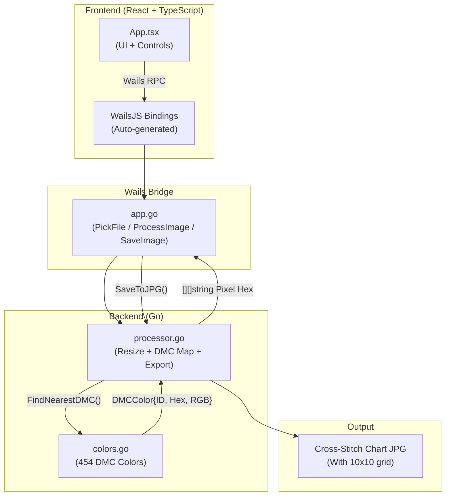

# PontoCrz

<div align="center">


**Convert photos into Cross-Stitch charts using the official DMC palette**

[](https://go.dev)
[](https://wails.io)
[](https://react.dev)
[](https://typescriptlang.org)
[](https://kernel.org)
[](https://microsoft.com)
[](https://snapcraft.io/ponto-crz)

</div>

---

## About

**PontoCrz** is a desktop application that converts images (JPG, PNG) into **Cross-Stitch charts**, featuring:

- **Official DMC palette** with 454 colors (RGB Euclidean distance mapping).
- **Nearest Neighbor** algorithm for resizing.
- **Technical grid** with 10×10 reference markers for counting stitches.
- **A4 / A3 export** at 300 DPI.

---

## Architecture



---

## Technology Stack

| Technology | Version | Purpose |
|---|---|---|
| **Go** | 1.21+ | Backend and image processing |
| **Wails** | v2.11 | Desktop bridge |
| **React** | 18 | User interface |
| **TypeScript** | 5 | Frontend logic |
| **Vite** | 3 | Build tool |
| **golang.org/x/image** | latest | Image resizing |
| **image/jpeg** | — | JPG export |
| **sync.WaitGroup** | — | Parallel processing |

---

## Core Logic

### 1. Image → DMC Pixels (`processor.go`)

```go
// Resize using Nearest Neighbor
resized := image.NewRGBA(image.Rect(0, 0, targetWidth, targetHeight))
draw.NearestNeighbor.Scale(resized, resized.Bounds(), img, bounds, draw.Over, nil)

// Map each pixel to the nearest DMC color
for y := startRow; y < endRow; y++ {
    for x := 0; x < targetWidth; x++ {
        c := resized.At(x, y)
        r32, g32, b32, _ := c.RGBA()
        r, g, b := uint8(r32>>8), uint8(g32>>8), uint8(b32>>8)

        nearest := FindNearestDMC(r, g, b)
        pixels[y][x] = nearest.Hex
    }
}
```

### 2. Export with Technical Grid (`processor.go`)

```go
func SaveToJPG(outputPath string, data *ProcessedImage, cellSize int) error {
    const gridSize = 1
    const majorSize = 3 

    // Grid lines every 10 squares
    for x := 0; x <= data.Width; x++ {
        thickness := gridSize
        if x > 0 && x%10 == 0 { thickness = majorSize }
        ...
    }
}
```

---

## Installation

### Prerequisites

- **Go** 1.21+: [go.dev/dl](https://go.dev/dl)
- **Node.js** 18+: [nodejs.org](https://nodejs.org)
- **Wails CLI**: `go install github.com/wailsapp/wails/v2/cmd/wails@latest`

---

### Linux — Direct Run

```bash
git clone https://github.com/erascardilva/pontoCrz.git
cd pontoCrz

chmod +x build/bin/pontoCrz
./build/bin/pontoCrz
```

---

### Windows — Direct Run

```
1. Download the repository
2. Run: build\bin\pontoCrz.exe
```

---

## Build from Source

### Linux
```bash
wails build
```

### Windows (Cross-compile)
```bash
wails build --platform windows/amd64 -nsis
```

---

## Project Structure

```
pontoCrz/
├── build/bin/                   ← Executables
├── backend/
│   ├── processor.go             ← Image processing
│   └── colors.go                ← DMC palette
├── frontend/src/
│   ├── App.tsx                  ← UI component
│   └── style.css                ← Styles
├── app.go                       ← Wails bridge
├── main.go                      ← Entry point
└── wails.json                   ← Configuration
```

---

## License

MIT License.

---

<div align="center">

**Erasmo Cardoso**<br>
**Software Engineer | Electronics Specialist**


</div>
